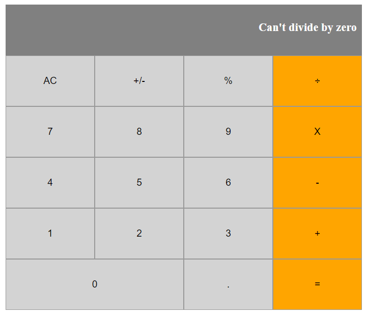

# React Calculator
> A calculator build with React.



<br>This project was made to learn how to work with React.<br>

## Content

* [Live Demo](#live-demo)
* [Requirements](#requirements)
* [Requisites](#built-with)
* [Built With](#built-with)
* [Game Design](#game-design)
* [Getting Start](#getting-start)
* [Contributing](#contributing)
* [Acknowledgments](#acknowledgments)
* [Author](#author)
* [License](#license)

## Live Demo
You can access a online version at:<br>
https://react-test-312.herokuapp.com/

## Requirements
- [x] Setup workflow
- [x] Deploy on Heroku

## Requisites
* [A modern web browser](https://www.google.com/chrome/)
* [Node JS](https://nodejs.org/en/download/)
* [Yarn](https://classic.yarnpkg.com/en/docs/install/#windows-stable)

## Built With

- React JS <br>
- Express JS <br>
- Javascript <br>
- HTML/CSS <br>
- Webpack and babel <br>
- JEST for tests <br>
- ESlint and Stylelint (Linters) <br>
- GitHub Actions (CI Tool) <br>
- Git, Github and VScode <br>

## Getting Start

#### Get a local copy
Now you need a copy of this application, if you are using Git:
```js
git clone git@github.com:SevlaMare/reactiveCalculator.git
```
Otherwise just hit (Download Zip) on green button (Code) at top of this page.

#### Open terminal
Open your terminal inside the game folder, and paste the following commands:

#### Download all dependencies
```js
npm install
```

#### Compile
```js
yarn build
```

#### Start the server
```js
yarn go
```

#### Go to a web browser (Like Google Chrome) and visit:
```js
localhost:7000
```

#### Run the tests
```js
yarn test
```

### Contributing

Contributions, issues and feature requests are welcome!

You can do it on [issues page](issues/).

## Acknowledgments

A special thanks for the code reviewers.

## Author

👤 **Thiago Miranda**

- Github: [@SevlaMare](https://github.com/SevlaMare)
- Twitter: [#SevlaMare](https://twitter.com/SevlaMare)
- Linkedin: [SevlaMare](https://www.linkedin.com/in/sevla-mare)

### License
<strong>Creative Commons • 2020</strong>
